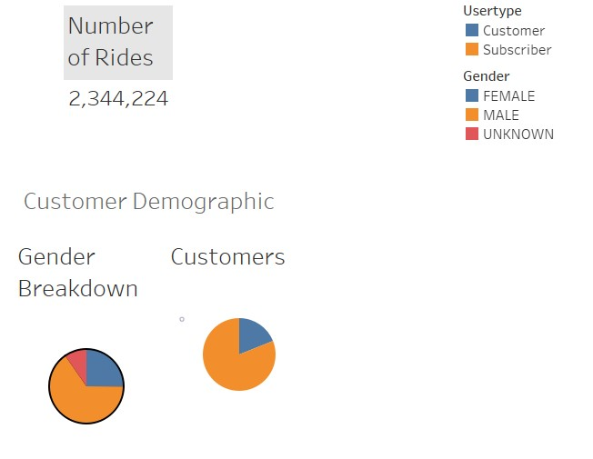

# Bikesharing

## Overview of the statistical analysis:

The purpose of the analysis is well defined. (5 pt)

## Results:

**_Deliverable 1_**: Change trip duration to a datetime format [NYC_CitiBike_Challenge.ipynb](NYC_CitiBike_Challenge.ipynb).

**_Deliverable 2_**: Visualizations for the NYC Citibike trip analysis (posted to tableau public)
1. [Checkout Times for Users](https://public.tableau.com/app/profile/kobert.lam/viz/NYCCitiBikeChallenge-CheckoutTimesforUsers/CheckoutTimesforUsers?publish=yes)
    * The top trip duration is 5 minutes which accounted for 146,752 trips.
    * 98.83% of trips are within one hour.
2. [Checkout Times by Gender](https://public.tableau.com/app/profile/kobert.lam/viz/NYCCitiBikeChallenge-CheckoutTimesbyGender/CheckoutTimesbyGender?publish=yes)
    * Top trip duration for male is 5 minutes, 6 minutes for female, and 11 minutes for unknown gender.
3. [Trips by Weekday per Hour](https://public.tableau.com/app/profile/kobert.lam/viz/NYCCitiBikeChallenge-TripsbyWeekdayperHour/TripsbyWeekdayperHour?publish=yes)
    * Most customers have the trip in 5-6pm and 7-9am from Monday to Friday.
4. [Trips by Gender (Weekday per Hour)](https://public.tableau.com/app/profile/kobert.lam/viz/NYCCitiBikeChallenge-TripsbyGenderWeekdayperHour/TripsbyGenderWeekdayperHour?publish=yes)
    * Most male and female customers have the trip in 7-9am and 5-6pm from Monday to Friday.
5. [User Trips by Gender by Weekday](https://public.tableau.com/app/profile/kobert.lam/viz/NYCCitiBikeChallenge-UserTripsbyGenderbyWeekday/UserTripsbyGenderbyWeekday?publish=yes)
    * Most male subscribers had the trips on Mon-Fri.
    * Most female subscribers had the trips on Mon-Sat.
    * Most non-subscribers had the trips on Sat and Sun.
6. [Summary:](https://public.tableau.com/app/profile/kobert.lam/viz/NYCCitiBikeChallenge-Summary/Summary?publish=yes)
    
    
    * This dashboard includes 3 viz created in this module:
        1. Number of Rides
        2. Gender Breakdown
        3. Customers
    * The total number of rides in Aug 2019 was **2,344,224**. Gender breakdown: Male 65.28%, Female 25.1%, and Unknown 9.62%. Customer type breakdown: Subscriber 81.07%, Customer 18.93%.

**_Deliverable 3_**: Story for the NYC Citibike (posted to tableau public)
[NYC CitiBike Challenge - Story](https://public.tableau.com/app/profile/kobert.lam/viz/NYCCitiBikeChallenge-Story/NYCCitiBikeAnalysis?publish=yes).

## Summary:
* Male customers are the majority (65.28%)
Two additional visualizations are suggested for future analysis (5 pt)
